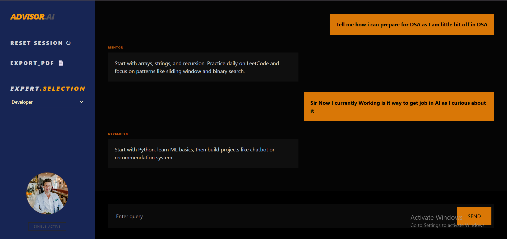

# 🚀 AI Advisor Chatbot


---

## ✨ Overview

AI Advisor Chatbot is a modern multi-persona conversational system designed to simulate real-world expert guidance.
It provides structured responses based on different roles such as **Mentor, Developer, HR, and Critic**, helping users prepare for placements, improve coding skills, and get career advice.

---

## 🧠 Key Features

* 🎭 Multi-Persona AI System (Mentor, Developer, HR, Critic)
* 💬 Interactive Chat Interface
* 🧾 Chat History Storage (Local Storage)
* 📄 Export Conversation as PDF
* ⚡ Smooth UI with animations and effects
* 🔁 Smart fallback AI (works without external API)
* 🎯 Placement-focused guidance system

---

## 📸 Screenshots



> 📌 Make sure you create a folder named **screenshots** and add your images inside it.

---

## 🛠️ Tech Stack

| Layer     | Technology                    |
| --------- | ----------------------------- |
| Frontend  | React, Tailwind CSS           |
| Backend   | Node.js, Express              |
| Libraries | Axios, jsPDF, Canvas Confetti |

---

## ⚙️ Installation & Setup

### 🔹 Clone the repository

```bash
git clone https://github.com/YOUR_USERNAME/ai-advisor-chatbot.git
cd ai-advisor-chatbot
```

---

### 🔹 Run Frontend

```bash
cd frontend
npm install
npm run dev
```

---

### 🔹 Run Backend

```bash
cd backend
npm install
node index.js
```

---

## 🎯 Use Cases

* 📌 Placement Preparation
* 📌 DSA Guidance
* 📌 AI/ML Learning Roadmap
* 📌 Mock Interview Simulation
* 📌 Career Advice System

---

## 🚀 Future Enhancements

* 🤖 Resume Analyzer
* 🎤 Voice Input Support
* 🧠 Memory-based Chat System
* 🌐 Live Deployment (Vercel + Render)

---

## 👨‍💻 Author

**Vikash Singh**
🎓 B.Tech CSE | Data Science Enthusiast

---

## ⭐ Support

If you found this project useful:

👉 Give it a ⭐ on GitHub
👉 Share with others

---

## 📌 Important Note

* This project includes a **fallback AI system** to ensure it works even without API limits.
* For full AI capability, integrate with OpenAI or Gemini APIs.

---

# 🔥 How to Add Screenshots (Quick Guide)

1. Create a folder in your project:

```bash
mkdir screenshots
```

2. Add your images:

```
screenshots/
 ├── ui.png
 ├── chat.png
```

3. Done ✅ (already linked above)

---

💡 *Built with focus on real-world placement readiness and practical learning.*
